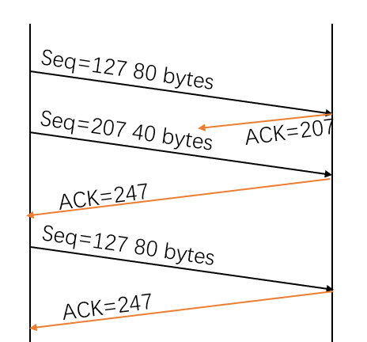
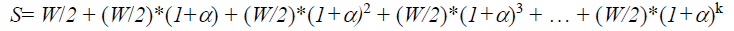

# 计算机网络课后习题

### Chapter1

P6、P9、P30、P31

---

#### problem 6

1. 传播时延：m/s second
2. 传输时长：L/R second
3. 端到端时延：（m/s + L/R） second
4. 在传输时长的时刻，最后一个比特在 Host A
5. 传播时延 > 传输时长：在传输时长的时刻：第一个比特在链路里面，还没有到达 Host B
6. 传播时延 < 传输时长：在传输时长的时刻：第一个比特已经到达 Host B
7. 两者联立得到： m=536km

#### Problem 9

1. 电路交换支持的最大用户数量 N = 10000

2. 分组交换 + 有M个用户的情况：多余N用户发送数据的概率公式
   $$
   P_{\ge N} = \sum_{n=N+1}^{M}p^{n}(a-p)^{M-n}
   $$
   

#### Problem 30

有这样类似的概念。

假设乘客及其行李对应于到达协议栈顶部的数据单元。乘客办理登机手续时，将检查其行李，并在行李和机票上贴上标签。如果图1.20允许行李层在送达侧实现服务或将旅客和行李分开，然后在目的地将其重新组合，则这是在行李层中添加的附加信息。然后，当乘客通过安全检查时，通常会在其机票上添加额外的邮票，以表明该乘客已通过安全检查。该信息用于确保人员的安全转移。

#### Problem 31

1. 只考虑传输时延：一次是 8*10^6 bits / 2Mbps = 4s, 存储转发经历 3 次，需要 12 s
2. 800分组：
   - 第一个分组：需要 10000 / 2 M = 0.005 s
   - 从第一台交换机发送第一个分组到第二台交换机  = = 源主机发送第二个分组到第一台交换机
   - 第二个分组完全被第一台交换机全部收到： 0.01 s
3. 报文分段：4 + 0.01 = 4.01 s，相比较而言少了很多时间。
4. 报文分段的原因：
   - 出现错误整个重新传输的话，任务量实在是太大了
   - 对于很大的包，需要很长的时间先进行处理，对于小包来说，反而需要等待相当长的时间

5. 报文分段的缺点：
   - 接收端需要按照顺序组织这些报文
   - 增加的头部引起额外的数据传输

### Chapter2

P7、P8、P22、P23、P34

#### Problem 7

获取IP地址的时间：RTT1 + RTT2 + ... + RTTn

总共相应的时间是：2RTT0 + RTT1 + RTT2 + ... + RTTn

#### Problem 8

HTML + 引用8个对象

- 非持续HTTP + 非并行：RTT1 + RTT2 + ... + RTTn + 18RTT0（2+16）
- 非持续HTTP +5个并行：RTT1 + RTT2 + ... + RTTn + 6RTT0
- 持续HTTP：RTT1 + RTT2 + ... + RTTn + 3RTT0

#### Problem 22

C-S模型
$$
Dcs = MAX\{NF/us, F/d_{min}\}
$$

|          | 10   | 100   | 1000   |
| -------- | ---- | ----- | ------ |
| 300 kbps | 7680 | 51200 | 512000 |
| 700 kbps | 7680 | 51200 | 512000 |
| 2 Mbps   | 7680 | 51200 | 512000 |

P2P模型
$$
D = MAX\{F/us,F/d_{min},NF(us+\sum_{i=1}^{N}ui)\}
$$
|          | 10   | 100   | 1000  |
| -------- | ---- | ----- | ----- |
| 300 kbps | 7680 | 25904 | 47559 |
| 700 kbps | 7680 | 15616 | 21525 |
| 2 Mbps   | 7680 | 7680  | 7680  |

#### Problem 23

1. 主机给每个用户分发资料：速度上线为 us/N，总时间 NF/us
2. 主机给每个用户分发资料：速度设置为 dmin，总时间 F/dmin

3. 综合1/2，得出结论

#### Problem 34

对于诸如远程登录（telnet 和 ssh）之类的应用程序，面向字节流的协议非常自然，因为在应用程序中没有消息边界的概念。当用户键入字符时，我们只需将字符放入TCP连接中即可。在其他应用程序中，我们可能正在发送一系列具有固有边界的消息。例如，当一台SMTP邮件服务器向另一台SMTP邮件服务器发送背对背的几封电子邮件时。由于TCP没有指示边界的机制，因此应用程序必须自己添加指示，以便应用程序的接收方可以区分一条消息和另一条消息。

如果将每个消息放入一个不同的UDP段中，则接收端将能够区分各种消息，而无需应用程序发送方添加任何指示。

### Chapter3

P3、P7、P8、P27、P31、P32、P52

#### Problem 3

- 三个数字加和为：00101110
- 反码是：11010001

- 使用反码而非该和：根据检查差错的原理，我们可以得到应该使用反码
- 检查差错：把所有的4个数字加起来，正常情况都是1，如果出现了0，就出错了
- 1 bit 差错：可以检测出来
- 2 bit 差错：有可能检测不出来，比如说两个数字相同位的bit对调

#### Problem 7

接收方向发送方发送的ACK分组没有序号：

- 首先说为什么我们首先需要序列号：

  我们看到发送方需要序列号，以便接收方可以知道数据包是否是已接收数据包的副本。

- 在ACK的情况下，发送方不需要此信息（即ACK上的序列号）来告知检测到重复的ACK。
- 对于rdt3.0接收器来说，重复的ACK很明显，因为当它收到原始ACK时，它将转换为下一个状态。
- 重复的ACK不是发送方需要的ACK，因此被rdt3.0发送方忽略。

#### Problem 8

协议rdt3.0的发送方与协议2.2的发送方不同之处在于已添加了超时。

超时的引入增加了重复数据包进入发送方到接收方数据流的可能性。

但是，协议rdt.2.2中的接收器已经可以处理重复的数据包。（如果接收方发送丢失的ACK，则rdt 2.2中的接收方重复将出现，然后发送方重新传输旧数据）。

因此，协议rdt2.2中的接收器也将充当协议rdt 3.0中的接收器。

#### Problem 27

1. 在从主机A到主机B的第二段中，序列号是207，源端口号是302，目的端口号是80。
2. 如果第一个段在第二个段之前到达，则在第一个到达段的确认中，确认号为207，源端口号为80，目的端口号为302。
3. 如果第二个段在第一个段之前到达，则在第一个到达段的确认中，确认号为127，表示它仍在等待字节127 及以后。
4. 

#### Problem 31

**DevRTT = (1- beta) * DevRTT + beta * | SampleRTT - EstimatedRTT |**
**EstimatedRTT = (1-alpha) * EstimatedRTT + alpha * SampleRTT**
**TimeoutInterval = EstimatedRTT + 4 * DevRTT**

After obtaining first SampleRTT 106ms:
DevRTT = 0.75*5 + 0.25 * | 106 - 100 | = 5.25ms
EstimatedRTT = 0.875 * 100 + 0.125 * 106 = 100.75 ms
TimeoutInterval = 100.75+4*5.25 = 121.75 ms

After obtaining 120ms:
DevRTT = 0.75 * 5.25 + 0.25 * | 120 – 100.75 | = 8.75 ms
EstimatedRTT = 0.875 * 100.75 + 0.125 * 120 = 103.16 ms
TimeoutInterval = 103.16+4*8.75 = 138.16 ms

After obtaining 140ms:
DevRTT = 0.75 * 8.75 + 0.25 * | 140 – 103.16 | = 15.77 ms
EstimatedRTT = 0.875 * 103.16 + 0.125 * 140 = 107.76 ms
TimeoutInterval = 107.76+4*15.77 = 170.84 ms

After obtaining 90ms:
DevRTT = 0.75 * 15.77 + 0.25 * | 90 – 107.76 | = 16.27 ms
EstimatedRTT = 0.875 * 107.76 + 0.125 * 90 = 105.54 ms
TimeoutInterval = 105.54+4*16.27 =170.62 ms

After obtaining 115ms:
DevRTT = 0.75 * 16.27 + 0.25 * | 115 – 105.54 | = 14.57 ms
EstimatedRTT = 0.875 * 105.54 + 0.125 * 115 = 106.72 ms
TimeoutInterval = 106.72+4 * 14.57 =165 ms

#### Problem 32

1. Denote EstimatedRTT (n) for the estimate after the nth sample

$$
EsitimatedRTT(4) 
$$

$$
=xSampleRTT1 +
					(1-x)[xSampleRTT2+
					(1-x)[xSampleRTT3+(1-x)SampleRTT4]]
$$

2. 扩展到n

$$
Esitimate(n)=x\sum_{j=1}^{n-1}(1-x)^{j-1}SampleRTTj + (1-x)^{n-1}SampleRTTn
$$

3. 当n趋向于无穷

$$
Esitimate(\infin)= \frac{x}{1-x}\sum_{j=1}^{\infin}(1-x)^{j}SampleRTTj
$$

#### Problem 52

令 W 表示最大窗口大小。

首先，我们可以找到在 TCP 将其窗口大小从W / 2更改为 W 并包括 W 的时间间隔内发送的段总数。

可以得到：
$$
k=\log_{1+\alpha}2
$$

$$
S=W*(2\alpha+1)/(2\alpha)
$$

Loss Rate L:
$$
L=1/S=\frac{2\alpha}{W(2\alpha+1)}
$$
Increased time:
$$
k*RTT=\log_{1+\alpha}2 * RTT
$$
TCP平均吞吐量
$$
B=\frac{MSS}{L*(K+1)*RTT}
$$
