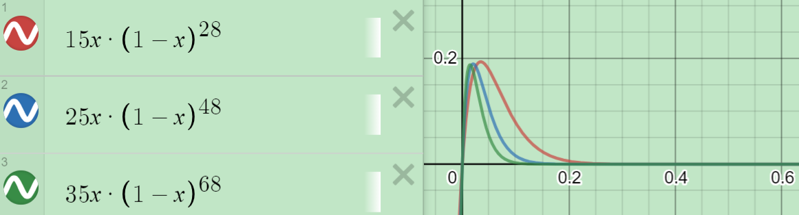
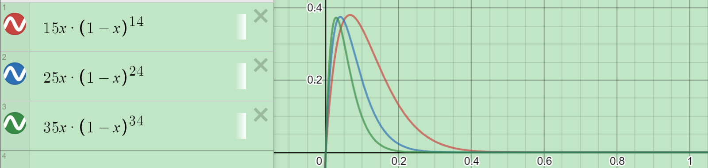

# 计算机网络课后习题 - 链路层

**Homework** CN-R4 ; R9 ; P1 ; P12 ; P26 

---

### CN-R4

当一个节点正在发送时，它将开始从另一个节点接收一个分组，这将发生冲突。

### R9

> MAC 地址空间有多大？IPv4的地址空间呢？IPv6的地址空间呢？

有 2^48 个MAC 地址；2^32 个 IPv4的地址 ；2^128 个IPv6的地址

### P1

1 1 1 0 + 1

0 1 1 0 + 0

1 0 0 1 + 0

1 1 0 1 + 1

1 1 0 0 + 0

### P12

纯 ALOHA 和 时隙 ALOHA 的效率：

**纯ALOHA**
$$
Np(1-p)^{2(N-1)}
$$

**时隙ALOHA** 
$$
N p(1-p)^{(N-1)}
$$

### P26

| 行为           | 开关表状态                       | 链路包前往 | 解释                                                       |
| -------------- | -------------------------------- | ---------- | ---------------------------------------------------------- |
| B 发送一帧给 E | 与B的MAC地址对应的交换机学习接口 | A,C,D,E,F  | 由于交换机表是空的，所以交换机不知道与E的MAC地址对应的接口 |
| E 回答一帧向 B | 与E的MAC地址对应的交换机学习接口 | B          | 由于交换机已经知道与B的MAC地址对应的接口                   |
| A 发送一帧向 B | 与A的MAC地址对应的交换机学习接口 | B          | 由于交换机已经知道与B的MAC地址对应的接口                   |
| B 回答一帧向 A | 切换表状态与以前相同。           | A          | 由于交换机已经知道与A的MAC地址对应的接口                   |

---

### Tanenbaum-P4

1. G = 50 / （1s / 40ms） = 2

   概率为 $e^{-2}$

2. k 次之后成功的概率是：

   $$
   (1-e^{-G})^{k}e^{-G} =0.135*0.865^k
   $$

3. 期望是：$e^G=7.4$
