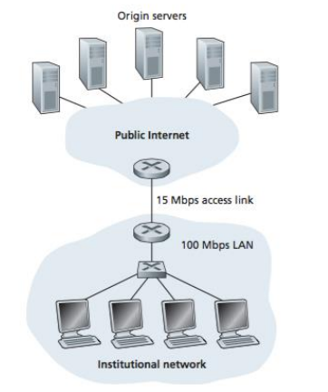

# Quiz for Computer Network

### Section 1 (10 pts) True or false?

我的答案是：T T F F F

> Two distinct Web pages (for example, www.sjtu.edu.cn/news.html and www.sjtu.edu.cn/research.html ) can be sent over the same persistent connection.

**True** 因为两个网页是使用相同的物理主机。

> With GBN, it is possible for the sender to receive an ACK for a packet that falls outside of its current window.

**True**

> With non-persistent connections between browser and origin server, it is possible for a single TCP segment to carry two distinct HTTP request messages.

**False** 非持续链接将会关闭

> The Date: header in the HTTP response message indicates when the object in the response was last modified. 

**False** Last-Modified

> HTTP response messages never have an empty message body.

**False** 对于Web服务器 - 缓存器之间：如果申请的对象没有被修改，那么回复一个 empty entity body 的响应报文。

### Section 2  (45 pts) Essay Questions

> We have said that an application may choose UDP for a transport protocol because UDP offers finer application control (than TCP) of what data is sent in a segment and when. 
>
> ​	i.  Why does an application have more control of what data is sent in a segment?
>
> ​	ii. Why does an application have more control on when the segment is sent?

i. 对比通过传输协议来发送应用程序的消息：

-  **TCP：** TCP将应用程序的信息写入`connection send buffer`，并且TCP将抓取字节并且不一定会放一个独立消息在分段中。同时TCP可能在一个分段里面放入数量不等的信息。

-   **UDP: ** 无论应用程序给出什么，UDP都会分段。相当于所有的信息都是UDP的有效负载。

  因此应用程序使用UDP将会对数据有更大的控制。

ii. UDP能够更好地控制信息发送的时间：

-  **TCP：** 由于流量控制和拥塞控制，当应用程序向`send buffer`写入数据时可能会有明显的延迟。
-  **UDP：** 没有这部分的延迟。

> Compare GBN, SR, and TCP (no delayed ACK). Assume that the timeout values for all three protocols are sufficiently long such that 5 consecutive data segments and their corresponding ACKs can be received (if not lost in the channel) by the receiving host (Host B) and the sending host (Host A) respectively. Suppose Host A sends 5 data segments to Host B, and the 2nd segment (sent from A) is lost. In the end, all 5 data segments have been correctly received by Host B.
>
> i. How many segments has Host A sent in total and how many ACKs has Host B sent in total? What are their sequence numbers? Answer this question for all three protocols. 
>
> ii. If the timeout values for all three protocol are much longer than 5 RTT, then which protocol successfully delivers all five data segments in shortest time interval?

a) 三种协议在2分段丢失的情况下：

| Protocols               | Host A          | Host B         |
| ----------------------- | --------------- | -------------- |
| **GBN**                 | **9** 123452345 | **8** 11112345 |
| **SR**                  | **6** 123452    | **5** 13452    |
| **TCP(no delayed ACK)** | **6** 123452    | **5** 22226    |

b) 超时的时间都远比 5RTT 长的时候，哪种协议成功传输协议的时候用时最短：

**TCP**. 因为 TCP 不用等待超时再重传，重传开始得最早。

> Suppose we have two network entities, A and B. B has a supply of data messages that will be sent to A according to the following conventions. When A gets a request from the layer above to get the next data (D) message from B, A must send a request (R) message to B on the A-to-B channel. Only when B receives an R message can it send a data (D) message back to A on the B-to- A channel. A should deliver exactly one copy of each D message to the layer above. R messages can be lost (but not corrupted) in the A-to-B channel; D messages, once sent, are always delivered correctly. The delay along both channels is unknown and variable. 
>
> Design (give an FSM description of) a protocol that incorporates the appropriate mechanisms to compensate for the loss-prone A-to-B channel and implements message passing to the layer above at entity A, as discussed above. Use only those mechanisms that are absolutely necessary. 

**首先分析：**

- 因为有可能丢失信息，所以需要设置超时，并且重新传输请求的信息。

- 因为信道的时延是变化的并且是位置的，所以对于A需要发送重复的请求。

- 为了能检测到重复发送，需要使用 1-bit sequence 来加以区分

**A**

-  **等待上层请求0： ** 如果收到上层请求，**就发送R0**，重启计时器，进入下一个状态
-  **等D0： ** 如果收到D0，停止计时，交付上层，进入下一个状态；如果超时，**重新发送R0**
-  **等待上层请求1： ** 如果收到上层请求，**就发送R1**，重启计时器，进入下一个状态
-  **等待D1： ** 如果收到D1，停止计时，交付上层，进入下一个状态；如果超时，**重新发送R1**

**B**

-  **发送D0： ** 

  收到R0，就向A发送D0，保持在这个状态。如果收到R1，代表A收到了D0，丢弃D0，进入下一个状态

-  **发送D1： ** 

  收到R0，就向A发送D1，保持在这个状态。如果收到R0，代表A收到了D1，丢弃D1，进入下一个状态

### Section 3 (30 pts) Calculation Questions

> Consider the right figure, for which there is an institutional network connected to the Internet. Suppose that the average object size is 850,000 bits and that the average request rate from the institution’s browsers to the origin servers is 16 requests per second. Also, suppose that the amount of time it takes from when the router on the Internet side of the access link forwards an HTTP request until it receives the response is three seconds on average. Model the total average response time as the sum of the average access delay (that is, the delay from Internet router to institution router) and the average Internet delay. For the average access delay, use ∆ /1−∆𝛽 , where ∆ is the average time required to send an object over the access link and 𝛽 𝑖s the arrival rate of objects to the access link.

1. 总的平均响应时间：

   - **传输时延：**(850000) / 15M = 0.567 sec
   - **流量强度：** 16 req/s * 0.59 s/req = 0.907
   - **平均接入时延：** 0.567/(1 - 0.907) = 0.6 s
   - **总时延:  ** 0.6 + 3 = 3.6 s

2. 丢失率是0.4情况下，总的平均响应时间：

   -  **平均访问时延：** 0.567 / (1 - 0.4 * (0.907)) = 0.089 s
   -  **cache: **
     - 缓存满足的时候几乎为0 - 60%
     - 缓存不满足的时候位 0.089s - 40%

   -  **总时延：**  60% * 0 + 40% * （3 + 0.089） = 1.24 s 

> Consider a short, 10-meter link, over which a sender can transmit at a rate of 150 bits/sec in both directions. Suppose that packets containing data are 100,000 bits long, and packets containing only control (e.g., ACK or handshaking) are 200 bits long. Assume that N parallel connections each get 1/N of the link bandwidth. Now consider the HTTP protocol, and suppose that each downloaded object is 100 Kbits long, and that the initial downloaded object contains 10 referenced objects from the same sender. Would parallel downloads via parallel instances of non-persistent HTTP make sense in this case? Now consider persistent HTTP. Do you expect significant gains over the non-persistent case? Justify and explain your answer.

 **TP = Time of Propagation: **  $10 / 3*10^8 = 3 * 10^{-8}s$

 **非持续性的HTTP： **

- 初始下载对象：

  3 * (200/150 + TP) + (100000/150 + TP)

- 10个并行下载对象：

  3 * (200/15 + TP) + (100000/15 + TP)

- **总共是：** 7377 + 8TP

 **持续性的HTTP：**

- 初始下载对象：

  3 * (200/150 + TP) + (100000/150 + TP)

- 10个下载对象：

  10 * (200/150 + TP + 100000/150 + TP)

 **总共是：** 7351 + 24TP

相比较而言，持续性的HTTP明显要快！