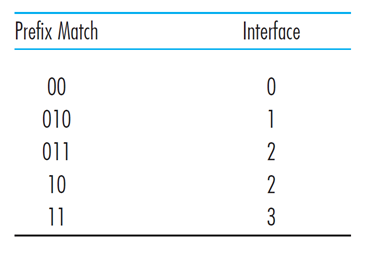
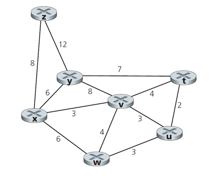

# Quiz for Computer Network2

### 1. Essay Question

- 10 pts - Describe how loops in paths can be detected in BGP.

  BGP 实际上是 Border Gateway Protocol 的缩写

  - 从 neighboring AS 可以获得子网可达性信息
  - AS 也传播他的可达性信息给所有的路由器
  - 对等体决定到其他 AS 系统的路由
  - BGP 使用 AS-PATH NEXT-PATH 属性作为判断的信息
    - AS-PATH 来检测回环：BGP对等体接收到包含自己的 AS 号的路由 AS 路径，如果使用这个路由就会短路。

- 15 pts - Will a BGP router always choose the loop-free route with the shortest AS-path length?

  是的， BGP 总会在无环路由中选择最短的 AS-path 长度。

  BGP 包含 从AS获取的子网可达性数据，并且维系这些数据以到达 AS 中所有的路由器。所以它是一个 Inter-AS 的路由协议。

  - Generally, the router may contain more than one path to any one prefix.
  - In this case, the BGP can apply the some elimination rules to catch the one route.
  - These elimination rules obtained from the AS_PATH. It is an inter domain routing. Then choose the loop-free route with the shortest AS- path length.

- 15 pts - Consider the count-to-infinity problem in the distance vector routing. Will the count-to-infinity problem occur if we decrease the cost of a link? Why? How about if we connect two nodes which do not have a link?

  不会，因为为减少链路的成本不会引起一个回环(由该链接的两个节点之间的下一跳关系引起)。连接两个节点相当于把权重从无穷变为有限的权重。

- Consider a virtual-circuit network. Suppose the VC number is an 8-bit field.

  - What is the maximum number of virtual circuits that can be carried over a link?

    2 ^ 8 = 256

  - Suppose a central node determines paths and VC numbers at connection setup. Suppose the same VC number is used on each link along the VC 's path. Describe how the central node might determine the VC number at connection setup. Is it possible that there are fewer VCs in progress than the maximum as determined in part (a) yet there is no common free VC number?

    是的，是因为中心化的机制在全局网络中实行一个 2 ^ 8 的边界。每个链接可以从集合{0,1，...，2 ^ 16 - 1}中独立分配 VC 号。因此，VC 沿其路径的每个链接可能具有不同的 VC 编号。 VC 路径中的每个路由器必须将每个到达数据包的 VC 编号替换为与出站链路关联的 VC 编号。

  - Suppose that different VC numbers are permitted in each link along a VC 's path. During connection setup, after an end-to-end path is determined, describe how the links can choose their VC numbers and configure their forwarding tables in a decentralized manner, without reliance on a central node.

    链接从集合{0，1，...，2 ^ 8 - 1}中选择其VC号。因此，VC沿其路径的每个链接可能具有不同的VC编号。 VC路径中的每个路由器必须将每个到达数据包的VC编号替换为与出站链路关联的VC编号。

### 2. Calculation Questions

- Consider a datagram network using 8-bit host addresses. Suppose a router uses longest prefix matching and has the following forwarding table:

  

  For each of the four interfaces, give the associated range of destination host addresses and the number of addresses in the range.

  - 00 means 00-000000 ->00-111111 destinations address between these.

  - 010 means 010,00000 ->010-11111 destinations address between these.

  - 011 means 011-00000 ->011-11111 destinations address between these.

  - 10 means 10-000000 ->10-111111 destinations address between these.

  - 11 means 11-000000 ->11-111111 destinations address between these.

    **Interface 0 -> 64**

    **Interface 1 -> 32**

    **Interface 2 -> 64 + 32 = 96**

    **Interface 3 -> 64**

- Consider the following network. With the indicated link costs, use Dijkstra’s shortest-path algorithm to compute the shortest path from *x* to all network nodes.

  

   

| S           | l(t),c(t) | l(u),c(u) | l(v),c(v) | l(w),c(w) | l(y),c(y) | l(z),c(z) |
| ----------- | --------- | --------- | --------- | --------- | --------- | --------- |
| **x**       | inf       | inf       | 3,x       | 6,x       | 6,x       | 8,x       |
| x**v**      | 7,v       | 6,v       | 3,x       | 6,x       | 6,x       | 8,x       |
| xv**u**     | 7,v       | 6,v       | 3,x       | 6,x       | 6,x       | 8,x       |
| xvu**w**    | 7,v       | 6,v       | 3,x       | 6,x       | 6,x       | 8,x       |
| xvuw**y**   | 7,v       | 6,v       | 3,x       | 6,x       | 6,x       | 8,x       |
| xvuwy**t**  | 7,v       | 6,v       | 3,x       | 6,x       | 6,x       | 8,x       |
| xvuwyt**z** | 7,v       | 6,v       | 3,x       | 6,x       | 6,x       | 8,x       |

### 3. Proof Question

Suppose two packets arrive to two different input ports of a router at exactly the same time. Also suppose there are no other packets anywhere in the router.

a. Suppose the two packets are to be forwarded to two *different* output ports. Is it possible to forward the two packets through the switch fabric at the same time when the fabric uses a *shared bus*?

**No, you can only transmit one packet at a time over a shared bus.** 

b. Suppose the two packets are to be forwarded to two *different* output ports. Is it possible to forward the two packets through the switch fabric at the same time when the fabric uses a *crossbar*?

**No, as discussed in the text, only one memory read/write can be done at a time over the shared system bus.** 

c. Suppose the two packets are to be forwarded to the *same* output port. Is it possible to forward the two packets through the switch fabric at the same time when the fabric uses a *crossbar*?

**No, in this case the two packets would have to be sent over the same output bus at the same time, which is not possible**